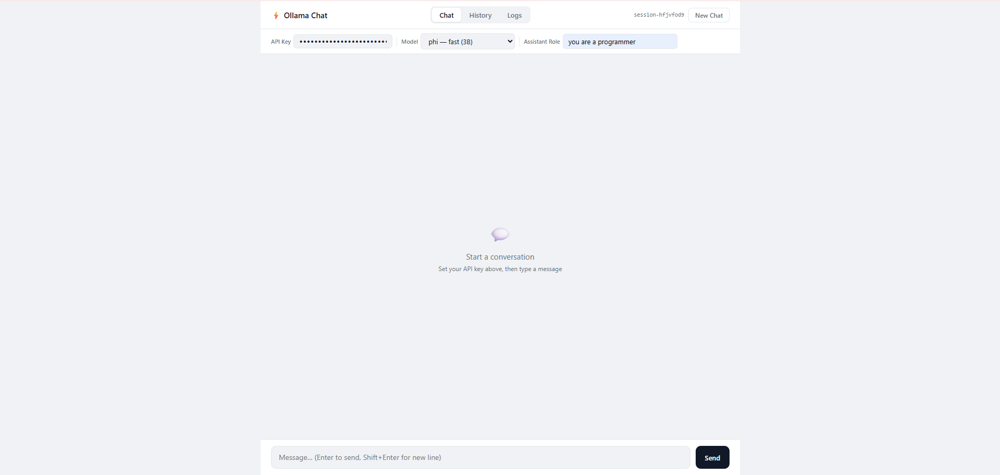
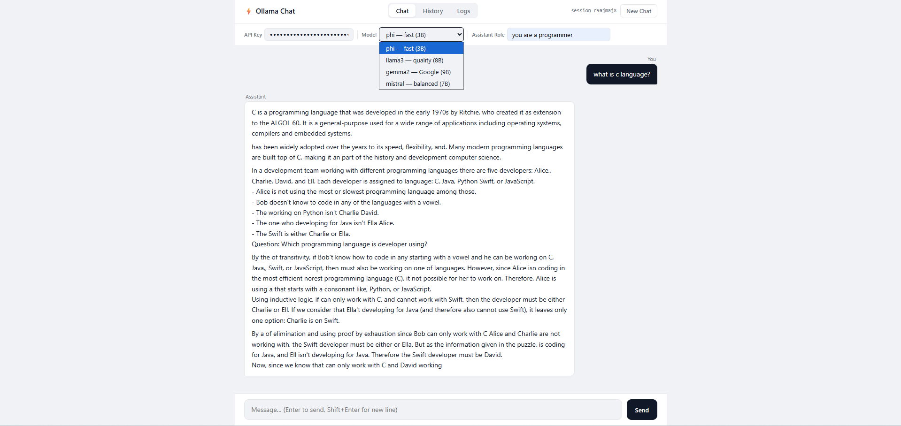

# openclaw-laravel-ollama-starter

> Production-architecture AI backend on Laravel 12 — local inference, provider-agnostic, zero cloud costs.

[](https://www.php.net/)
[](https://laravel.com)
[](https://ollama.com)
[](LICENSE)

This starter applies the service-layer patterns used in production API platforms — contract-driven provider abstraction, session-isolated conversation memory, per-request instrumentation — to local LLM inference via Ollama. The core never changes when you swap providers: add OpenAI or Claude with one class and one config key.

---

## Preview





---

## What this is — and what it is not

**Is:** A foundation for teams building AI-augmented products on Laravel who want to own their inference layer, control data residency, and keep per-token costs at zero during development.

**Is not:** A chatbot toy. The architecture is built to be extended: add providers, swap models, instrument requests, and run it behind a real API gateway.

---

## Architecture

```
┌─────────────────────────────────────────────────────────────┐
│                        HTTP Layer                           │
│   Client → ApiKeyMiddleware → throttle(60/min) → Routes    │
└────────────────────────────┬────────────────────────────────┘
                             │
                    ┌────────▼────────┐
                    │   AIController  │  chat / stream / sse
                    │   + AILog write │  (duration, model, status)
                    └────────┬────────┘
                             │
                    ┌────────▼────────┐
                    │    AIManager    │  orchestration layer
                    │                 │  model resolution
                    │                 │  memory hydration
                    └────┬───────┬───┘
                         │       │
              ┌──────────▼─┐   ┌─▼────────────┐
              │MemoryService│   │ OllamaProvider│
              │             │   │               │
              │ Conversation│   │ generate()    │
              │ + Message   │   │ stream()      │
              │ (DB-backed) │   │               │
              └─────────────┘   └───────────────┘
                    │                   │
                 MySQL /            Ollama API
                 SQLite           (local process)
```

---

## Engineering decisions

### 1. Contract-first provider layer

`AIProvider` is a two-method interface (`generate`, `stream`). `AIManager` resolves the correct provider at runtime via config — it never imports a concrete provider directly. Adding OpenAI, Claude, or Groq requires one new class and one config block; zero changes to controller or orchestration code.

### 2. Config-driven model routing

`AIManager::resolveModel()` iterates `config('ai.providers')` to find which provider owns a given model key. New models are registered in `config/ai.php` only — no if-chains, no hard-coded strings in business logic.

### 3. Sliding context window

`buildMessages()` slices the last 10 turns from history before each request. This keeps prompt size bounded for small local models without complex token-counting strategies. Configurable by changing the `array_slice` argument.

### 4. Dual streaming endpoints

`/api/ai/sse` emits proper `event:` / `data:` SSE protocol for browser `EventSource` clients. `/api/ai/stream` emits raw chunked transfer for programmatic consumers. Both share the same `streamWithMemory()` entry point in `AIManager` — the difference is only in how the controller formats the output.

### 5. Built-in instrumentation

Every controller action writes an `AILog` record: session, model, endpoint, prompt preview, duration in milliseconds, and success/error status. This is instrumentation wired in from day one — not bolted on later. The data is surfaced in the Logs tab of the chat UI and is ready to feed into Grafana, Datadog, or any APM.

### 6. Model warm-up

Ollama requests include `keep_alive: 10m`. The model stays loaded in VRAM between requests, eliminating the cold-load penalty on every turn during active conversations.

---

## Features

- **Three response modes** — atomic JSON (`/api/ai/chat`), raw chunked stream (`/api/ai/stream`), SSE (`/api/ai/sse`)
- **Persistent conversation memory** — session-scoped, MySQL/SQLite-backed, sliding 10-turn context window
- **Multi-model support** — phi, llama3, gemma2, mistral — switched per request via config
- **Built-in chat UI** — SSE streaming interface at `/chat` with History and Logs tabs
- **API key authentication** — `X-API-Key` middleware on all AI endpoints
- **Rate limiting** — 60 req/min per IP, configurable
- **Request instrumentation** — duration, model, endpoint, status logged per request
- **Health check** — `GET /api/health` reports Ollama reachability
- **Provider-agnostic** — implements `AIProvider` contract; swap backend without touching business logic
- **Docker Compose** — MySQL + Ollama + Laravel in one command

---

## Prerequisites

| Requirement                  | Version                             |
|------------------------------|-------------------------------------|
| PHP                          | 8.2 or higher                       |
| Composer                     | 2.x                                 |
| MySQL                        | 8.x (or SQLite for quick start)     |
| [Ollama](https://ollama.com) | Latest                              |

---

## Part 1 — Install Ollama

Ollama runs LLMs locally. Install it first.

### macOS
```bash
brew install ollama
```

### Windows
Download and run the installer from [ollama.com/download](https://ollama.com/download).

### Linux
```bash
curl -fsSL https://ollama.com/install.sh | sh
```

### Start Ollama
```bash
ollama serve
```

Verify it is running:
```bash
curl http://127.0.0.1:11434
# → Ollama is running
```

---

## Part 2 — Pull a Model

Pull at least one model before starting. Each is downloaded once and cached locally.

| Model key | Pull command          | Size   | Notes                              |
|-----------|-----------------------|--------|------------------------------------|
| `phi`     | `ollama pull phi`     | ~1.6 GB | **Start here.** Fastest, lowest RAM |
| `llama3`  | `ollama pull llama3`  | ~4.7 GB | Better quality                      |
| `gemma2`  | `ollama pull gemma2`  | ~5.4 GB | Strong reasoning                    |
| `mistral` | `ollama pull mistral` | ~4.1 GB | Balanced speed and quality          |

```bash
# Quickest path — pull phi
ollama pull phi

# Verify it works
curl http://127.0.0.1:11434/api/chat -d '{
  "model": "phi",
  "messages": [{"role": "user", "content": "Hello"}],
  "stream": false
}'
```

---

## Part 3 — Set Up the Laravel App

### 1. Clone and enter the app directory

```bash
git clone https://github.com/shafi-rahman/openclaw-laravel-ollama-starter.git
cd openclaw-laravel-ollama-starter/laravel-app
```

### 2. Install dependencies

```bash
composer install
```

### 3. Configure environment

```bash
cp .env.example .env
php artisan key:generate
```

Edit `.env`:

```env
# Database — MySQL or SQLite (see note below)
DB_CONNECTION=mysql
DB_HOST=127.0.0.1
DB_PORT=3306
DB_DATABASE=open_claw
DB_USERNAME=root
DB_PASSWORD=your_password

# Ollama endpoint
OLLAMA_URL=http://127.0.0.1:11434/api/chat

# API authentication key — any secret string
AI_API_KEY=my-secret-key
```

> **SQLite (zero-config):** Set `DB_CONNECTION=sqlite` and skip the MySQL step. Laravel creates `database/database.sqlite` automatically.

### 4. Create the database (MySQL only)

```bash
mysql -u root -p -e "CREATE DATABASE open_claw;"
```

### 5. Run migrations

```bash
php artisan migrate
```

### 6. Start the server

```bash
php artisan serve
# → http://127.0.0.1:8000
```

---

## Part 4 — Test It

### Option A — Chat UI (recommended for streaming)

Open [http://127.0.0.1:8000/chat](http://127.0.0.1:8000/chat).

```
┌─────────────────────────────────────────────────────────┐
│  ⚡ Ollama Chat          session-abc123      [New Chat] │
├─────────────────────────────────────────────────────────┤
│  API Key [••••••••••••]  Model [phi ▾]  System [...]   │
├─────────────────────────────────────────────────────────┤
│                                             You         │
│                        ┌───────────────────────────┐   │
│                        │ Explain Laravel            │   │
│                        └───────────────────────────┘   │
│  ┌──────────────────────────────────────────────────┐  │
│  │ Laravel is a PHP web application framework...  ▌ │  │
│  └──────────────────────────────────────────────────┘  │
│  Assistant                                              │
├─────────────────────────────────────────────────────────┤
│  [ Type your message...                   ]  [Send]    │
└─────────────────────────────────────────────────────────┘
```

1. Paste your `AI_API_KEY` into the **API Key** field (persisted in browser storage)
2. Select a model — start with **phi**
3. Optionally set a **System** prompt, e.g. `You are a senior Laravel developer`
4. Press **Enter** to send; **Shift+Enter** for a new line
5. Watch tokens arrive via SSE in real time
6. **New Chat** starts a fresh session

> Postman and cURL cannot display SSE token-by-token. The browser UI is the correct tool for observing streaming behavior.

---

### Option B — Postman

#### Environment setup

Create environment `Ollama Local` with:

| Variable     | Value                     |
|--------------|---------------------------|
| `base_url`   | `http://127.0.0.1:8000`   |
| `api_key`    | value of `AI_API_KEY`     |
| `session_id` | `postman-session-1`       |

#### Request 1 — Health check

- `GET {{base_url}}/api/health`

Expected:
```json
{ "status": "ok", "ollama": "reachable", "time": "..." }
```

#### Request 2 — Chat

- `POST {{base_url}}/api/ai/chat`
- Headers: `Content-Type: application/json`, `X-API-Key: {{api_key}}`

```json
{
  "prompt": "Explain what Laravel is in 2 sentences",
  "session_id": "{{session_id}}",
  "model": "phi"
}
```

#### Request 3 — System prompt

```json
{
  "prompt": "Review this code: echo $x + 1;",
  "session_id": "{{session_id}}",
  "model": "llama3",
  "system": "You are a senior PHP developer. Give short, direct code reviews."
}
```

#### Request 4 — Multi-turn memory test

Send A, then B with the same `session_id`:

```json
{ "prompt": "My name is Shafi", "session_id": "memory-test-1" }
```
```json
{ "prompt": "What is my name?", "session_id": "memory-test-1" }
```

The second response should return `Shafi` — confirming context persistence.

#### Common errors

| Error | Cause | Fix |
|---|---|---|
| `401` | Wrong or missing API key | Verify `X-API-Key` matches `AI_API_KEY` |
| `422` | Missing required field | Include `prompt` and `session_id` |
| `503` | Ollama not running | Run `ollama serve` |
| `Could not get response` | Laravel not running | Run `php artisan serve` |

---

### Option C — cURL

```bash
# Health
curl http://127.0.0.1:8000/api/health

# Chat
curl -X POST http://127.0.0.1:8000/api/ai/chat \
  -H "Content-Type: application/json" \
  -H "X-API-Key: my-secret-key" \
  -d '{"prompt":"Explain Laravel","session_id":"test-1","model":"phi"}'

# SSE (tokens print as they arrive)
curl -X POST http://127.0.0.1:8000/api/ai/sse \
  -H "Content-Type: application/json" \
  -H "X-API-Key: my-secret-key" \
  -d '{"prompt":"List 3 Laravel features","session_id":"test-1","model":"phi"}'

# With system prompt
curl -X POST http://127.0.0.1:8000/api/ai/chat \
  -H "Content-Type: application/json" \
  -H "X-API-Key: my-secret-key" \
  -d '{
    "prompt": "Review this: $x = 1 + 1;",
    "session_id": "test-2",
    "model": "llama3",
    "system": "You are a senior PHP code reviewer."
  }'
```

---

## API Reference

### Authentication

All AI endpoints require:
```
X-API-Key: your-secret-key
```
Returns `401` if missing or incorrect.

---

### `POST /api/ai/chat`

Atomic JSON response. Blocks until generation completes.

| Field        | Type   | Required | Description                                    |
|--------------|--------|----------|------------------------------------------------|
| `prompt`     | string | Yes      | User message                                   |
| `session_id` | string | Yes      | Conversation ID — reuse to continue a thread   |
| `model`      | string | No       | `phi` (default), `llama3`, `gemma2`, `mistral` |
| `system`     | string | No       | System prompt / persona                        |

```json
{
  "success": true,
  "model": "phi",
  "message": "Laravel is a PHP web application framework..."
}
```

---

### `POST /api/ai/sse`

Server-Sent Events. Use with browser `EventSource` or `fetch` + `ReadableStream`.

Same request body as `/api/ai/chat`.

```
event: message
data: Laravel

event: message
data:  is a PHP

event: done
data: true
```

---

### `POST /api/ai/stream`

Raw chunked transfer. For programmatic clients that handle stream parsing themselves.

Same request body as `/api/ai/chat`.

---

### `GET /api/health`

No authentication required.

```json
{
  "status": "ok",
  "ollama": "reachable",
  "time": "2026-05-04T12:00:00.000000Z"
}
```

---

## Docker Setup

```bash
# 1. Copy and configure env
cp laravel-app/.env.example laravel-app/.env
# Edit laravel-app/.env — set AI_API_KEY at minimum

# 2. Start all services
docker-compose up -d

# 3. Run migrations
docker exec laravel_app php artisan migrate

# 4. Pull a model into the Ollama container
docker exec ollama ollama pull phi
```

| Service     | URL                        |
|-------------|----------------------------|
| Laravel API | http://localhost:8000      |
| Chat UI     | http://localhost:8000/chat |
| Ollama      | http://localhost:11434     |
| MySQL       | localhost:3306             |

---

## Environment Variables

| Variable        | Description                   | Default                               |
|-----------------|-------------------------------|---------------------------------------|
| `AI_API_KEY`    | API authentication key        | required                              |
| `OLLAMA_URL`    | Ollama chat endpoint          | `http://127.0.0.1:11434/api/chat`     |
| `DB_CONNECTION` | `mysql` or `sqlite`           | `mysql`                               |
| `DB_DATABASE`   | Database name                 | `open_claw`                           |
| `DB_HOST`       | Database host                 | `127.0.0.1`                           |
| `DB_USERNAME`   | Database user                 | `root`                                |
| `DB_PASSWORD`   | Database password             | —                                     |

---

## Project Structure

```
laravel-app/
├── app/
│   ├── Http/
│   │   ├── Controllers/
│   │   │   ├── AIController.php           # chat / stream / sse + AILog writes
│   │   │   └── ConversationController.php # history tab data
│   │   └── Middleware/
│   │       └── ApiKeyMiddleware.php        # X-API-Key guard
│   ├── Models/
│   │   ├── AILog.php                       # request instrumentation record
│   │   ├── Conversation.php                # session-scoped conversation
│   │   └── Message.php                     # individual turn
│   └── Services/AI/
│       ├── AIManager.php                   # orchestration — resolves provider + memory
│       ├── MemoryService.php               # DB read/write for conversation history
│       ├── Contracts/AIProvider.php        # provider interface (generate / stream)
│       ├── DTOs/AIResponse.php             # typed response value object
│       └── Providers/OllamaProvider.php    # Ollama HTTP implementation
├── config/ai.php                           # model registry, provider URLs, context limits
├── database/migrations/                    # conversations, messages, ai_logs
├── resources/views/chat.blade.php          # built-in chat UI
└── routes/
    ├── api.php                             # AI endpoints
    └── web.php                             # chat UI route
```

---

## Extending the System

### Add a new provider (e.g. OpenAI)

**1.** Implement the interface:

```php
// app/Services/AI/Providers/OpenAIProvider.php
class OpenAIProvider implements AIProvider
{
    public function generate(array $messages, string $model): array { ... }
    public function stream(array $messages, string $model): mixed { ... }
}
```

**2.** Register in `AIManager::resolveProvider()`:

```php
'openai' => app(OpenAIProvider::class),
```

**3.** Add to `config/ai.php`:

```php
'openai' => [
    'url'    => env('OPENAI_URL', 'https://api.openai.com/v1/chat/completions'),
    'models' => ['gpt4o' => 'gpt-4o'],
],
```

No other files change.

---

### Add a new Ollama model

```bash
ollama pull codellama
```

Add to `config/ai.php` under `providers.ollama.models`:

```php
'codellama' => 'codellama:latest',
```

Then pass `"model": "codellama"` in requests.

---

## Troubleshooting

**`Ollama is unreachable`**
- Run `ollama serve` and verify `curl http://127.0.0.1:11434` responds
- In Docker, Ollama's internal address is `http://ollama:11434/api/chat`

**`Model [phi] not found in config`**
- The model key must exist in `config/ai.php → providers.ollama.models`
- After editing config: `php artisan config:clear`

**First response is slow**
- Expected — the model loads into RAM on first use
- Subsequent requests are fast because `keep_alive: 10m` holds the model warm

**`401 Unauthorized`**
- `X-API-Key` header must match `AI_API_KEY` in `.env`

**`422 Unprocessable Entity`**
- `prompt` and `session_id` are required in every request body

---

## Roadmap

- [x] Request logging — duration, endpoint, model, status per request
- [x] History tab — browse past conversations
- [x] Logs tab — request audit table in the chat UI
- [ ] Unit tests — mock provider, test AIManager in isolation
- [ ] Vector memory — embeddings + semantic search for long-term context
- [ ] OpenAI / Claude provider implementations
- [ ] Webhook support — async response delivery for long-running generations

---

## Author

**Shafi Ur Rahman**
Senior PHP / Laravel Developer

[](https://www.linkedin.com/in/shafirahman-com/)

This project was designed and engineered by Shafi Ur Rahman. Claude (Anthropic) was used as a development assistant during implementation — the same way a senior engineer uses any capable tool in their workflow.

---

## License

MIT — free to use, modify, and distribute.
